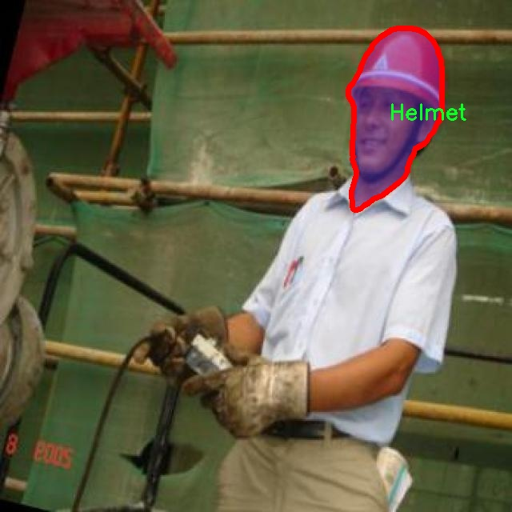

# 建筑工地个人防护装备分割系统源码＆数据集分享
 [yolov8-seg-C2f-RFCBAMConv＆yolov8-seg-FocalModulation等50+全套改进创新点发刊_一键训练教程_Web前端展示]

### 1.研究背景与意义

项目参考[ILSVRC ImageNet Large Scale Visual Recognition Challenge](https://gitee.com/YOLOv8_YOLOv11_Segmentation_Studio/projects)

项目来源[AAAI Global Al lnnovation Contest](https://kdocs.cn/l/cszuIiCKVNis)

研究背景与意义

随着建筑行业的快速发展，工地安全问题日益突出，个人防护装备（PPE）的使用成为保障工人安全的重要措施。根据国际劳工组织（ILO）的统计，建筑行业的事故发生率高于其他行业，许多事故的发生与工人未能正确佩戴个人防护装备密切相关。因此，如何有效监测和管理工地上的个人防护装备使用情况，成为提升工地安全管理水平的重要课题。近年来，计算机视觉技术的快速发展为这一问题提供了新的解决方案，尤其是基于深度学习的目标检测与分割技术，能够实现对工地环境中个人防护装备的自动识别与监测。

YOLO（You Only Look Once）系列模型因其高效的实时检测能力，广泛应用于各类视觉任务中。YOLOv8作为该系列的最新版本，进一步提升了检测精度和速度，适合于复杂的工地环境。然而，现有的YOLOv8模型在特定领域的应用仍存在一定的局限性，尤其是在对多类个人防护装备的精确分割和识别方面。因此，基于改进YOLOv8的建筑工地个人防护装备分割系统的研究，具有重要的理论和实践意义。

本研究将利用包含4500张图像的“PPE Construction_GlovesAdded”数据集，该数据集涵盖了六类个人防护装备：靴子、手套、护目镜、安全帽、工人和背心。这些类别的多样性为模型的训练提供了丰富的样本，能够有效提升模型在实际应用中的泛化能力。通过对数据集的深入分析与处理，研究将着重解决在复杂背景下对个人防护装备的准确识别与分割问题。尤其是在工地环境中，光照变化、遮挡物及工人活动等因素都可能影响检测效果，因此对YOLOv8进行改进，以提高其在这些挑战下的表现，显得尤为重要。

此外，个人防护装备的实时监测与管理不仅能够提高工人的安全意识，还能为建筑企业提供有效的安全管理工具。通过建立基于YOLOv8的分割系统，企业可以实时获取工地上个人防护装备的使用情况，及时发现未佩戴或佩戴不当的工人，从而采取相应的安全措施。这一系统的实施将有助于降低工地事故发生率，提升整体安全管理水平。

综上所述，基于改进YOLOv8的建筑工地个人防护装备分割系统的研究，不仅具有重要的学术价值，还能为实际应用提供切实可行的解决方案。通过该研究，期望能够推动建筑行业在安全管理方面的技术进步，为工人的生命安全保驾护航。

### 2.图片演示


##### 注意：由于此博客编辑较早，上面“2.图片演示”和“3.视频演示”展示的系统图片或者视频可能为老版本，新版本在老版本的基础上升级如下：（实际效果以升级的新版本为准）

  （1）适配了YOLOV8的“目标检测”模型和“实例分割”模型，通过加载相应的权重（.pt）文件即可自适应加载模型。

  （2）支持“图片识别”、“视频识别”、“摄像头实时识别”三种识别模式。

  （3）支持“图片识别”、“视频识别”、“摄像头实时识别”三种识别结果保存导出，解决手动导出（容易卡顿出现爆内存）存在的问题，识别完自动保存结果并导出到tempDir中。

  （4）支持Web前端系统中的标题、背景图等自定义修改，后面提供修改教程。

  另外本项目提供训练的数据集和训练教程,暂不提供权重文件（best.pt）,需要您按照教程进行训练后实现图片演示和Web前端界面演示的效果。

### 3.视频演示

[3.1 视频演示](https://www.bilibili.com/video/BV1vm2HYVECc/)

### 4.数据集信息展示

##### 4.1 本项目数据集详细数据（类别数＆类别名）

nc: 6
names: ['Boots', 'Gloves', 'Goggles', 'Helmet', 'Person', 'Vest']


##### 4.2 本项目数据集信息介绍

数据集信息展示

在现代建筑工地的安全管理中，个人防护装备（PPE）的有效使用至关重要。为了提高对建筑工地中个人防护装备的识别和分割能力，我们构建了一个名为“PPE Construction_GlovesAdded”的数据集。该数据集专门用于训练和改进YOLOv8-seg模型，以实现对建筑工地中各种个人防护装备的精准分割。数据集的设计不仅考虑了装备的多样性，还注重了在实际应用中的有效性和准确性。

“PPE Construction_GlovesAdded”数据集包含六个类别，分别是：Boots（靴子）、Gloves（手套）、Goggles（护目镜）、Helmet（安全帽）、Person（人员）和Vest（背心）。这些类别涵盖了建筑工地上常见的个人防护装备，能够为模型提供丰富的训练样本，帮助其在复杂的环境中进行准确的物体识别和分割。每个类别都经过精心标注，确保数据的高质量和高准确性，以便于模型学习和推理。

在数据集的构建过程中，我们收集了大量来自不同建筑工地的图像，确保样本的多样性和代表性。这些图像不仅包含了不同类型的个人防护装备，还涵盖了各种环境条件，如不同的光照、天气和工作场景。这种多样性使得模型在训练过程中能够更好地适应现实世界中的变化，从而提高其泛化能力和实用性。

数据集中的每个类别都包含了大量的标注实例。例如，Boots类别中的图像展示了不同款式和颜色的靴子，Gloves类别则包括了多种类型的手套，如防割手套和耐磨手套。Goggles和Helmet类别则展示了多种安全护目镜和安全帽的样式，而Vest类别则包括了反光背心等多种类型的安全服装。Person类别则标注了在工地上穿戴个人防护装备的工人，确保模型能够识别出装备的使用者。

通过使用“PPE Construction_GlovesAdded”数据集，YOLOv8-seg模型能够学习到如何在复杂的建筑工地环境中识别和分割这些个人防护装备。这不仅有助于提高工地的安全管理水平，还能为相关行业提供智能化的解决方案，减少因个人防护装备不当使用而导致的安全隐患。

总之，“PPE Construction_GlovesAdded”数据集为建筑工地个人防护装备的智能识别和分割提供了坚实的基础。通过对该数据集的深入研究和应用，我们期望能够推动建筑行业在安全管理方面的技术进步，提升工人的安全保障水平，为构建更安全的工作环境贡献力量。




### 5.全套项目环境部署视频教程（零基础手把手教学）

[5.1 环境部署教程链接（零基础手把手教学）](https://www.bilibili.com/video/BV1jG4Ve4E9t/?vd_source=bc9aec86d164b67a7004b996143742dc)


[5.2 安装Python虚拟环境创建和依赖库安装视频教程链接（零基础手把手教学）](https://www.bilibili.com/video/BV1nA4VeYEze/?vd_source=bc9aec86d164b67a7004b996143742dc)

### 6.手把手YOLOV8-seg训练视频教程（零基础小白有手就能学会）

[6.1 手把手YOLOV8-seg训练视频教程（零基础小白有手就能学会）](https://www.bilibili.com/video/BV1cA4VeYETe/?vd_source=bc9aec86d164b67a7004b996143742dc)


按照上面的训练视频教程链接加载项目提供的数据集，运行train.py即可开始训练



     Epoch   gpu_mem       box       obj       cls    labels  img_size
     1/200     0G   0.01576   0.01955  0.007536        22      1280: 100%|██████████| 849/849 [14:42<00:00,  1.04s/it]
               Class     Images     Labels          P          R     mAP@.5 mAP@.5:.95: 100%|██████████| 213/213 [01:14<00:00,  2.87it/s]
                 all       3395      17314      0.994      0.957      0.0957      0.0843

     Epoch   gpu_mem       box       obj       cls    labels  img_size
     2/200     0G   0.01578   0.01923  0.007006        22      1280: 100%|██████████| 849/849 [14:44<00:00,  1.04s/it]
               Class     Images     Labels          P          R     mAP@.5 mAP@.5:.95: 100%|██████████| 213/213 [01:12<00:00,  2.95it/s]
                 all       3395      17314      0.996      0.956      0.0957      0.0845

     Epoch   gpu_mem       box       obj       cls    labels  img_size
     3/200     0G   0.01561    0.0191  0.006895        27      1280: 100%|██████████| 849/849 [10:56<00:00,  1.29it/s]
               Class     Images     Labels          P          R     mAP@.5 mAP@.5:.95: 100%|███████   | 187/213 [00:52<00:00,  4.04it/s]
                 all       3395      17314      0.996      0.957      0.0957      0.0845


### 7.50+种全套YOLOV8-seg创新点代码加载调参视频教程（一键加载写好的改进模型的配置文件）

[7.1 50+种全套YOLOV8-seg创新点代码加载调参视频教程（一键加载写好的改进模型的配置文件）](https://www.bilibili.com/video/BV1Hw4VePEXv/?vd_source=bc9aec86d164b67a7004b996143742dc)

### 8.YOLOV8-seg图像分割算法原理

原始YOLOv8-seg算法原理

YOLOv8-seg算法是YOLO系列中的最新进展，专注于目标检测与分割任务的高效实现。该算法在YOLOv8的基础上，结合了目标检测和实例分割的需求，形成了一种新颖的框架，旨在提高目标识别的精度和速度，同时增强对复杂场景的适应能力。YOLOv8-seg不仅延续了YOLO系列一贯的高效性和实时性，还在特征提取、特征融合及目标定位等方面进行了深入的优化。

首先，YOLOv8-seg的网络结构由输入层、主干网络、特征增强网络和检测头组成。输入层负责对输入图像进行预处理，确保其符合模型的输入要求。主干网络采用了CSPNet的思想，利用卷积操作对图像进行下采样，以提取丰富的特征信息。该部分的设计不仅考虑了特征的提取效率，还注重了特征的多样性。通过引入SiLU激活函数和批归一化，主干网络在特征提取的过程中有效地增强了模型的非线性表达能力，提升了检测的准确性。

在特征增强网络中，YOLOv8-seg结合了特征金字塔网络（FPN）和路径聚合网络（PAN）的优势，形成了一种高效的特征融合机制。FPN通过多尺度特征图的融合，确保了不同尺度目标的有效检测，而PAN则通过跨层连接增强了特征的流动性，使得模型能够更好地捕捉到目标的上下文信息。这种特征融合策略使得YOLOv8-seg在处理复杂场景时，能够有效地整合来自不同层次的特征信息，从而提高了模型的整体性能。

YOLOv8-seg的检测头采用了解耦的设计，分别处理目标的分类和定位任务。这种解耦设计的核心在于将分类和回归任务分开进行，允许每个任务专注于其特定的目标。这种方法不仅减少了任务之间的干扰，还提升了模型在复杂场景下的鲁棒性。通过并行的卷积分支，YOLOv8-seg能够同时计算类别和位置的损失，确保了目标检测的高效性和准确性。

与传统的锚框方法不同，YOLOv8-seg采用了Anchor-free的目标检测策略。这一策略的核心在于直接预测目标的位置和大小，避免了锚框选择和调整的繁琐过程。通过这种回归方式，模型能够更快地聚焦于目标的实际位置，使得预测框更接近于真实的边界框。这种方法在处理不同尺度和形状的目标时，展现出了更高的灵活性和适应性。

在实例分割方面，YOLOv8-seg通过引入额外的分割头来实现对目标的精确分割。该分割头在特征增强网络的基础上，利用上采样和卷积操作生成目标的分割掩码。这一过程不仅提高了目标的定位精度，还增强了对目标形状的描述能力，使得模型能够在复杂背景下准确地分割出目标实例。通过这种方式，YOLOv8-seg实现了目标检测与分割的无缝结合，为实际应用提供了更为全面的解决方案。

此外，YOLOv8-seg在轻量化设计方面也做出了显著的改进。通过使用更轻量化的C2F模块替代传统的C3模块，YOLOv8-seg在保持高效性的同时，进一步降低了模型的计算复杂度。这一优化使得YOLOv8-seg能够在嵌入式设备上高效运行，满足实时检测和分割的需求。这种轻量化设计不仅提升了模型的部署灵活性，也使得其在移动设备和边缘计算场景中展现出了广泛的应用潜力。

综上所述，YOLOv8-seg算法通过其独特的网络结构设计、特征融合策略和解耦检测头，成功地将目标检测与实例分割结合在一起，形成了一种高效、准确且灵活的解决方案。其Anchor-free的目标检测方法和轻量化设计，使得YOLOv8-seg在实际应用中具备了更强的适应性和实用性。随着YOLOv8-seg的不断发展和优化，未来在智能监控、自动驾驶、医疗影像等领域的应用前景将更加广阔。


### 9.系统功能展示（检测对象为举例，实际内容以本项目数据集为准）

图9.1.系统支持检测结果表格显示

  图9.2.系统支持置信度和IOU阈值手动调节

  图9.3.系统支持自定义加载权重文件best.pt(需要你通过步骤5中训练获得)

  图9.4.系统支持摄像头实时识别

  图9.5.系统支持图片识别

  图9.6.系统支持视频识别

  图9.7.系统支持识别结果文件自动保存

  图9.8.系统支持Excel导出检测结果数据


### 10.50+种全套YOLOV8-seg创新点原理讲解（非科班也可以轻松写刊发刊，V11版本正在科研待更新）

#### 10.1 由于篇幅限制，每个创新点的具体原理讲解就不一一展开，具体见下列网址中的创新点对应子项目的技术原理博客网址【Blog】：


[10.1 50+种全套YOLOV8-seg创新点原理讲解链接](https://gitee.com/qunmasj/good)

#### 10.2 部分改进模块原理讲解(完整的改进原理见上图和技术博客链接)【此小节的图要是加载失败请移步原始博客查看，链接：https://blog.csdn.net/cheng2333333?type=blog】
### 深度学习基础
卷积神经网络通过使用具有共享参数的卷积运算显著降低了模型的计算开销和复杂性。在LeNet、AlexNet和VGG等经典网络的驱动下，卷积神经网络现在已经建立了一个完整的系统，并在深度学习领域形成了先进的卷积神经网络模型。

感受野注意力卷积RFCBAMConv的作者在仔细研究了卷积运算之后获得了灵感。对于分类、目标检测和语义分割任务，一方面，图像中不同位置的对象的形状、大小、颜色和分布是可变的。在卷积操作期间，卷积核在每个感受野中使用相同的参数来提取信息，而不考虑来自不同位置的差分信息。这限制了网络的性能，这已经在最近的许多工作中得到了证实。

另一方面，卷积运算没有考虑每个特征的重要性，这进一步影响了提取特征的有效性，并最终限制了模型的性能。此外，注意力机制允许模型专注于重要特征，这可以增强特征提取的优势和卷积神经网络捕获详细特征信息的能力。因此，注意力机制在深度学习中得到了广泛的应用，并成功地应用于各个领域。

通过研究卷积运算的内在缺陷和注意力机制的特点，作者认为现有的空间注意力机制从本质上解决了卷积运算的参数共享问题，但仍局限于对空间特征的认知。对于较大的卷积核，现有的空间注意力机制并没有完全解决共享参数的问题。此外，他们无法强调感受野中每个特征的重要性，例如现有的卷积块注意力模块（CBAM）和 Coordinate注意力（CA）。

因此，[参考该博客提出了一种新的感受野注意力机制（RFA）](https://qunmasj.com)，它完全解决了卷积核共享参数的问题，并充分考虑了感受野中每个特征的重要性。通过RFA设计的卷积运算（RFAConv）是一种新的卷积运算，可以取代现有神经网络中的标准卷积运算。RFAConv通过添加一些参数和计算开销来提高网络性能。

大量关于Imagnet-1k、MS COCO和VOC的实验已经证明了RFAConv的有效性。作为一种由注意力构建的新型卷积运算，它超过了由CAM、CBAM和CA构建的卷积运算（CAMConv、CBAMConv、CAConv）以及标准卷积运算。

此外，为了解决现有方法提取感受野特征速度慢的问题，提出了一种轻量级操作。在构建RFAConv的过程中，再次设计了CA和CBAM的升级版本，并进行了相关实验。作者认为当前的空间注意力机制应该将注意力放在感受野空间特征上，以促进当前空间注意力机制的发展，并再次增强卷积神经网络架构的优势。


### 卷积神经网络架构
出色的神经网络架构可以提高不同任务的性能。卷积运算作为卷积神经网络的一种基本运算，推动了人工智能的发展，并为车辆检测、无人机图像、医学等先进的网络模型做出了贡献。He等人认为随着网络深度的增加，该模型将变得难以训练并产生退化现象，因此他们提出了残差连接来创新卷积神经网络架构的设计。Huang等人通过重用特征来解决网络梯度消失问题，增强了特征信息，他们再次创新了卷积神经网络架构。

通过对卷积运算的详细研究，Dai等人认为，具有固定采样位置的卷积运算在一定程度上限制了网络的性能，因此提出了Deformable Conv，通过学习偏移来改变卷积核的采样位置。在Deformable Conv的基础上，再次提出了Deformable Conv V2和Deformable Conv V3，以提高卷积网络的性能。

Zhang等人注意到，组卷积可以减少模型的参数数量和计算开销。然而，少于组内信息的交互将影响最终的网络性能。1×1的卷积可以与信息相互作用。然而，这将带来更多的参数和计算开销，因此他们提出了无参数的“通道Shuffle”操作来与组之间的信息交互。

Ma等人通过实验得出结论，对于参数较少的模型，推理速度不一定更快，对于计算量较小的模型，推理也不一定更快。经过仔细研究提出了Shufflenet V2。

YOLO将输入图像划分为网格，以预测对象的位置和类别。经过不断的研究，已经提出了8个版本的基于YOLO的目标检测器，如YOLOv5、YOLOv7、YOLOv8等。上述卷积神经网络架构已经取得了巨大的成功。然而，它们并没有解决提取特征过程中的参数共享问题。本文的工作从注意力机制开始，从一个新的角度解决卷积参数共享问题。

### 注意力机制
注意力机制被用作一种提高网络模型性能的技术，使其能够专注于关键特性。注意力机制理论已经在深度学习中建立了一个完整而成熟的体系。Hu等人提出了一种Squeeze-and-Excitation（SE）块，通过压缩特征来聚合全局通道信息，从而获得与每个通道对应的权重。Wang等人认为，当SE与信息交互时，单个通道和权重之间的对应关系是间接的，因此设计了高效通道注Efficient Channel Attention力（ECA），并用自适应kernel大小的一维卷积取代了SE中的全连接（FC）层。Woo等人提出了卷积块注意力模块（CBAM），它结合了通道注意力和空间注意力。作为一个即插即用模块，它可以嵌入卷积神经网络中，以提高网络性能。

尽管SE和CBAM已经提高了网络的性能。Hou等人仍然发现压缩特征在SE和CBAM中丢失了太多信息。因此，他们提出了轻量级Coordinate注意力（CA）来解决SE和CBAM中的问题。Fu等人计了一个空间注意力模块和通道注意力模块，用于扩展全卷积网络（FCN），分别对空间维度和通道维度的语义相关性进行建模。Zhang等人在通道上生成不同尺度的特征图，以建立更有效的通道注意力机制。

本文从一个新的角度解决了标准卷积运算的参数共享问题。这就是将注意力机制结合起来构造卷积运算。尽管目前的注意力机制已经获得了良好的性能，但它们仍然没有关注感受野的空间特征。因此，设计了具有非共享参数的RFA卷积运算，以提高网络的性能。


#### 回顾标准卷积
以标准卷积运算为基础构建卷积神经网络，通过共享参数的滑动窗口提取特征信息，解决了全连接层构建的神经网络的固有问题（即参数数量大、计算开销高）。

设表示输入特征图，其中、和分别表示特征图的通道数、高度和宽度。为了能够清楚地展示卷积核提取特征信息的过程，以为例。提取每个感受野slider的特征信息的卷积运算可以表示如下：


这里，表示在每次卷积slider操作之后获得的值，表示在每个slider内的相应位置处的像素值。表示卷积核，表示卷积核中的参数数量，表示感受野slider的总数。

可以看出，每个slider内相同位置的特征共享相同的参数。因此，标准的卷积运算无法感知不同位置带来的差异信息，这在一定程度上限制了卷积神经网络的性能。

#### 回顾空间注意力
目前，空间注意力机制使用通过学习获得的注意力图来突出每个特征的重要性。与上一节类似，以为例。突出关键特征的空间注意力机制可以简单地表达如下：


这里，表示在加权运算之后获得的值。和分别表示输入特征图和学习注意力图在不同位置的值，是输入特征图的高度和宽度的乘积，表示像素值的总数。一般来说，整个过程可以简单地表示在图1中。


#### 空间注意力与标准卷积
众所周知，将注意力机制引入卷积神经网络可以提高网络的性能。通过标准的卷积运算和对现有空间注意力机制的仔细分析。作者认为空间注意力机制本质上解决了卷积神经网络的固有缺点，即共享参数的问题。

目前，该模型最常见的卷积核大小为1×1和3×3。引入空间注意力机制后用于提取特征的卷积操作是1×1或3×3卷积操作。这个过程可以直观地显示出来。空间注意力机制被插入到1×1卷积运算的前面。通过注意力图对输入特征图进行加权运算（Re-weight“×”），最后通过1×1卷积运算提取感受野的slider特征信息。

整个过程可以简单地表示如下：


 

这里，卷积核仅表示一个参数值。如果将的值作为一个新的卷积核参数，那么有趣的是，通过1×1卷积运算提取特征时的参数共享问题得到了解决。然而，空间注意力机制的传说到此结束。当空间注意力机制被插入到3×3卷积运算的前面时。具体情况如下：


如上所述，如果取的值。作为一种新的卷积核参数，上述方程完全解决了大规模卷积核的参数共享问题。然而，最重要的一点是，卷积核在每个感受野slider中提取将共享部分特征的特征。换句话说，在每个感受野slider内都会有重叠。

经过仔细分析发现，，…，空间注意力图的权重在每个slider内共享。因此，空间注意机制不能解决大规模卷积核共享参数的问题，因为它们不注意感受野的空间特征。在这种情况下，空间注意力机制是有限的。
#### 创新空间注意力与标准卷积
RFA是为了解决空间注意力机制问题而提出的，创新了空间注意力。使用与RFA相同的思想，一系列空间注意力机制可以再次提高性能。RFA设计的卷积运算可以被视为一种轻量级的即插即用模块，以取代标准卷积，从而提高卷积神经网络的性能。因此，作者认为空间注意力机制和标准卷积在未来将有一个新的春天。

感受野的空间特征：

现在给出感受野空间特征的定义。它是专门为卷积核设计的，并根据kernel大小动态生成，如图2所示，以3×3卷积核为例。


在图2中，“空间特征”表示原始特征图，等于空间特征。“感受野空间特征”表示变换后的特征，该特征由每个感受野slider滑块组成，并且不重叠。也就是说，“感受野空间特征”中的每个3×3大小的slider表示提取原始3×3卷积特征时所有感觉野slider的特征。

#### 感受野注意力卷积(RFA):

关于感受野空间特征，该博客的作者提出了感受野注意（RFA），它不仅强调了感受野slider内各种特征的重要性，而且还关注感受野空间特性，以彻底解决卷积核参数共享的问题。感受野空间特征是根据卷积核的大小动态生成的，因此，RFA是卷积的固定组合，不能脱离卷积运算的帮助，卷积运算同时依赖RFA来提高性能。

因此，作者提出了感受野注意力卷积（RFAConv）。具有3×3大小卷积核的RFAConv的总体结构如图3所示。


目前，提取感受野特征最常用的方法速度较慢，因此经过不断探索提出了一种快速的方法，通过分组卷积来取代原来的方法。

具体来说，根据感受野大小，使用相应的组卷积大小来动态生成展开特征。尽管与原始的无参数方法（如Pytorch提供的nn.Unfld()）相比，该方法添加了一些参数，但速度要快得多。

注意：正如在上一节中提到的，当原始的3×3卷积核提取特征时，感受野空间特征中的每个3×3大小的窗口表示所有感受野滑块的特征。但在快速分组卷积提取感受野特征后，由于原始方法太慢，它们会被映射到新的特征中。

最近的一些工作已经证明信息交互可以提高网络性能。类似地，对于RFAConv，与感受野特征信息交互以学习注意力图可以提高网络性能，但与每个感受野特征交互将带来额外的计算开销。为了确保少量的计算开销和参数数量，通过探索使用AvgPool池化每个感受野特征的全局信息，然后通过1×1组卷积运算与信息交互。最后，softmax用于强调感受野特征中每个特征的重要性。通常，RFA的计算可以表示为：


表示分组卷积，表示卷积核的大小，代表规范化，表示输入特征图，是通过将注意力图与变换的感受野空间特征相乘而获得的。

与CBAM和CA不同，RFA可以为每个感受野特征生成注意力图。标准卷积受到卷积神经网络性能的限制，因为共享参数的卷积运算对位置带来的差异信息不敏感。RFA完全可以解决这个问题，具体细节如下：


由于RFA获得的特征图是“调整形状”后不重叠的感受野空间特征，因此通过池化每个感受野滑块的特征信息来学习学习的注意力图。换句话说，RFA学习的注意力图不再在每个感受野slider内共享，并且是有效的。这完全解决了现有的CA和CBAM对大尺寸kernel的注意力机制中的参数共享问题。

同时，RFA给标准卷积核带来了相当大的好处，但调整形状后，特征的高度和宽度是k倍，需要进行k×k的stride卷积运算，才能提取特征信息。RFAConv创新了标准卷积运算。

此外，空间注意力机制将得到升级，因为作者认为现有的空间注意力机制应该专注于感受野空间特征，以提高网络的性能。众所周知，基于自注意力机制的网络模型取得了巨大的成功，因为它解决了卷积参数共享的问题，并对远程信息进行了建模，但基于自注意力机理的方法给模型带来了巨大的计算开销和复杂性。作者认为通过将一些现有空间注意力机制的注意力放在感受野空间特征中，它以轻量级的方式解决了自注意力机制的问题。

答案如下：

将关注感受野空间特征的空间注意力与卷积相匹配，完全解决了卷积参数共享的问题；

当前的空间注意力机制本身具有考虑远距离信息的特点，它们通过全局平均池化或全局最大池化来获得全局信息，这在一定程度上考虑了远距离信息。


为此，作者设计了一种新的CBAM和CA，称为RFACBAM和RFACA，它专注于感受野的空间特征。与RFA类似，使用stride为k的k×k的最终卷积运算来提取特征信息，具体结构如图4和图5所示，将这2种新的卷积方法称为RFCBAMConv和RFCAConv。比较原始的CBAM，使用SE注意力来代替RFCBAM中的CAM。因为这样可以减少计算开销。


此外，在RFCBAM中，通道和空间注意力不是在单独的步骤中执行的，因为通道和空间注意力是同时加权的，从而允许在每个通道上获得的注意力图是不同的。


### 11.项目核心源码讲解（再也不用担心看不懂代码逻辑）

#### 11.1 ultralytics\models\__init__.py

以下是对给定代码的逐行分析和核心部分的保留，同时添加了详细的中文注释：

```python
# Ultralytics YOLO 🚀, AGPL-3.0 license

# 从当前包中导入 RTDETR、SAM 和 YOLO 类
from .rtdetr import RTDETR  # 导入 RTDETR 类
from .sam import SAM        # 导入 SAM 类
from .yolo import YOLO      # 导入 YOLO 类

# 定义可导出的模块成员，允许在其他模块中更简单地导入这些类
__all__ = 'YOLO', 'RTDETR', 'SAM'  # 允许使用 'from module import *' 导入这些类
```

### 代码分析：
1. **导入模块**：
   - 代码通过相对导入的方式从当前包中导入了三个类：`RTDETR`、`SAM` 和 `YOLO`。这些类可能是实现特定功能的核心组件。

2. **`__all__` 变量**：
   - `__all__` 是一个特殊变量，用于定义当使用 `from module import *` 时，哪些名称会被导入。这里定义了 `YOLO`、`RTDETR` 和 `SAM`，意味着这三个类是该模块的主要接口。

### 核心部分：
- 核心部分主要是导入类和定义 `__all__` 变量，因为这决定了模块的可用接口。

这个文件是Ultralytics YOLO项目中的一个初始化文件，通常用于定义模块的公共接口。在这个文件中，首先引入了三个类：RTDETR、SAM和YOLO，这些类分别来自于当前包中的不同模块（rtdetr、sam和yolo）。这些类可能代表了不同的模型或算法，分别用于目标检测、分割或其他计算机视觉任务。

接下来，`__all__`变量被定义为一个包含字符串的元组，列出了希望在使用`from module import *`语句时公开的名称。在这里，`__all__`包含了'YOLO'、'RTDETR'和'SAM'，这意味着当用户从这个模块导入时，只有这三个类会被导入，而其他未列出的名称将不会被导入。这种做法有助于控制模块的接口，避免不必要的名称冲突，并使得模块的使用更加清晰。

总的来说，这个文件的主要作用是组织和简化模块的导入，使得用户可以方便地使用YOLO及其相关模型。

#### 11.2 ui.py

以下是保留的核心代码部分，并附上详细的中文注释：

```python
import sys
import subprocess

def run_script(script_path):
    """
    使用当前 Python 环境运行指定的脚本。

    Args:
        script_path (str): 要运行的脚本路径

    Returns:
        None
    """
    # 获取当前 Python 解释器的路径
    python_path = sys.executable

    # 构建运行命令，使用 streamlit 运行指定的脚本
    command = f'"{python_path}" -m streamlit run "{script_path}"'

    # 执行命令，shell=True 允许使用 shell 命令
    result = subprocess.run(command, shell=True)
    
    # 检查命令执行的返回码，如果不为 0 则表示出错
    if result.returncode != 0:
        print("脚本运行出错。")

# 实例化并运行应用
if __name__ == "__main__":
    # 指定要运行的脚本路径
    script_path = "web.py"  # 这里可以直接指定脚本路径

    # 调用函数运行脚本
    run_script(script_path)
```

### 代码注释说明：
1. **导入模块**：
   - `sys`：用于访问与 Python 解释器相关的变量和函数。
   - `subprocess`：用于创建新进程、连接到它们的输入/输出/错误管道，并获得返回码。

2. **`run_script` 函数**：
   - 接受一个参数 `script_path`，表示要运行的 Python 脚本的路径。
   - 使用 `sys.executable` 获取当前 Python 解释器的路径，以确保在正确的环境中运行脚本。
   - 构建命令字符串，使用 `streamlit` 模块运行指定的脚本。
   - 使用 `subprocess.run` 执行命令，并通过 `shell=True` 允许使用 shell 命令。
   - 检查命令的返回码，如果返回码不为 0，表示脚本运行出错，打印错误信息。

3. **主程序块**：
   - 通过 `if __name__ == "__main__":` 确保只有在直接运行该脚本时才会执行以下代码。
   - 指定要运行的脚本路径 `web.py`。
   - 调用 `run_script` 函数来执行指定的脚本。

这个程序文件名为 `ui.py`，主要功能是通过当前的 Python 环境来运行一个指定的脚本，具体是一个名为 `web.py` 的文件。程序首先导入了必要的模块，包括 `sys`、`os` 和 `subprocess`，以及一个自定义的 `abs_path` 函数，用于获取脚本的绝对路径。

在 `run_script` 函数中，首先获取当前 Python 解释器的路径，这样可以确保在正确的环境中运行脚本。接着，构建一个命令字符串，使用 `streamlit` 模块来运行指定的脚本。`streamlit` 是一个用于构建数据应用的框架，命令的格式为 `python -m streamlit run script_path`。

然后，使用 `subprocess.run` 方法执行这个命令。该方法会在一个新的 shell 中运行命令，并返回一个结果对象。通过检查 `result.returncode`，可以判断脚本是否成功运行。如果返回码不为零，表示脚本运行出错，程序会输出相应的错误信息。

在文件的最后部分，使用 `if __name__ == "__main__":` 来确保当该文件作为主程序运行时，才会执行以下代码。这里指定了要运行的脚本路径，即 `web.py`，并调用 `run_script` 函数来执行这个脚本。

总体来说，这个程序的主要作用是提供一个简单的接口来运行 `web.py` 脚本，确保在正确的 Python 环境中执行，并处理可能出现的错误。

#### 11.3 ultralytics\nn\backbone\EfficientFormerV2.py

以下是代码中最核心的部分，并附上详细的中文注释：

```python
import torch
import torch.nn as nn
import math
import itertools

class Attention4D(nn.Module):
    def __init__(self, dim=384, key_dim=32, num_heads=8, attn_ratio=4, resolution=7, act_layer=nn.ReLU, stride=None):
        super().__init__()
        self.num_heads = num_heads  # 注意力头的数量
        self.scale = key_dim ** -0.5  # 缩放因子
        self.key_dim = key_dim  # 键的维度
        self.nh_kd = key_dim * num_heads  # 总的键维度

        # 如果有步幅，则进行卷积和上采样
        if stride is not None:
            self.resolution = math.ceil(resolution / stride)  # 计算新的分辨率
            self.stride_conv = nn.Sequential(
                nn.Conv2d(dim, dim, kernel_size=3, stride=stride, padding=1, groups=dim),
                nn.BatchNorm2d(dim),
            )
            self.upsample = nn.Upsample(scale_factor=stride, mode='bilinear')
        else:
            self.resolution = resolution
            self.stride_conv = None
            self.upsample = None

        self.N = self.resolution ** 2  # 总的空间位置数
        self.d = int(attn_ratio * key_dim)  # 注意力输出的维度
        self.dh = self.d * num_heads  # 总的输出维度
        self.attn_ratio = attn_ratio  # 注意力比率

        # 定义查询、键、值的卷积层
        self.q = nn.Sequential(nn.Conv2d(dim, self.num_heads * self.key_dim, 1), nn.BatchNorm2d(self.num_heads * self.key_dim))
        self.k = nn.Sequential(nn.Conv2d(dim, self.num_heads * self.key_dim, 1), nn.BatchNorm2d(self.num_heads * self.key_dim))
        self.v = nn.Sequential(nn.Conv2d(dim, self.num_heads * self.d, 1), nn.BatchNorm2d(self.num_heads * self.d))

        # 局部值的卷积层
        self.v_local = nn.Sequential(
            nn.Conv2d(self.num_heads * self.d, self.num_heads * self.d, kernel_size=3, stride=1, padding=1, groups=self.num_heads * self.d),
            nn.BatchNorm2d(self.num_heads * self.d),
        )

        # 处理注意力的卷积层
        self.talking_head1 = nn.Conv2d(self.num_heads, self.num_heads, kernel_size=1, stride=1, padding=0)
        self.talking_head2 = nn.Conv2d(self.num_heads, self.num_heads, kernel_size=1, stride=1, padding=0)

        # 最终的投影层
        self.proj = nn.Sequential(act_layer(), nn.Conv2d(self.dh, dim, 1), nn.BatchNorm2d(dim))

        # 计算注意力偏置
        points = list(itertools.product(range(self.resolution), range(self.resolution)))
        N = len(points)
        attention_offsets = {}
        idxs = []
        for p1 in points:
            for p2 in points:
                offset = (abs(p1[0] - p2[0]), abs(p1[1] - p2[1]))
                if offset not in attention_offsets:
                    attention_offsets[offset] = len(attention_offsets)
                idxs.append(attention_offsets[offset])
        self.attention_biases = nn.Parameter(torch.zeros(num_heads, len(attention_offsets)))  # 注意力偏置参数
        self.register_buffer('attention_bias_idxs', torch.LongTensor(idxs).view(N, N))  # 注册缓冲区

    @torch.no_grad()
    def train(self, mode=True):
        super().train(mode)
        if mode and hasattr(self, 'ab'):
            del self.ab  # 删除训练模式下的偏置
        else:
            self.ab = self.attention_biases[:, self.attention_bias_idxs]  # 使用偏置

    def forward(self, x):  # 前向传播
        B, C, H, W = x.shape  # 获取输入的形状
        if self.stride_conv is not None:
            x = self.stride_conv(x)  # 应用步幅卷积

        # 计算查询、键、值
        q = self.q(x).flatten(2).reshape(B, self.num_heads, -1, self.N).permute(0, 1, 3, 2)
        k = self.k(x).flatten(2).reshape(B, self.num_heads, -1, self.N).permute(0, 1, 2, 3)
        v = self.v(x)
        v_local = self.v_local(v)
        v = v.flatten(2).reshape(B, self.num_heads, -1, self.N).permute(0, 1, 3, 2)

        # 计算注意力
        attn = (q @ k) * self.scale + (self.attention_biases[:, self.attention_bias_idxs] if self.training else self.ab)
        attn = self.talking_head1(attn)
        attn = attn.softmax(dim=-1)  # softmax归一化
        attn = self.talking_head2(attn)

        # 计算输出
        x = (attn @ v)
        out = x.transpose(2, 3).reshape(B, self.dh, self.resolution, self.resolution) + v_local
        if self.upsample is not None:
            out = self.upsample(out)  # 上采样

        out = self.proj(out)  # 最终投影
        return out

# 定义模型的构建函数
def efficientformerv2_s0(weights='', **kwargs):
    model = EfficientFormerV2(
        layers=EfficientFormer_depth['S0'],
        embed_dims=EfficientFormer_width['S0'],
        downsamples=[True, True, True, True, True],
        vit_num=2,
        drop_path_rate=0.0,
        e_ratios=expansion_ratios_S0,
        **kwargs)
    if weights:
        pretrained_weight = torch.load(weights)['model']
        model.load_state_dict(update_weight(model.state_dict(), pretrained_weight))
    return model

# 其他模型构建函数类似，省略...
```

### 代码注释说明：
1. **Attention4D类**：实现了一个四维注意力机制，包含查询、键、值的计算以及注意力的应用。
2. **构造函数**：初始化参数，包括注意力头数、键的维度、分辨率等，并定义了各个卷积层。
3. **train方法**：重写了训练模式的方法，管理注意力偏置的使用。
4. **forward方法**：实现了前向传播逻辑，计算注意力并生成输出。
5. **efficientformerv2_s0函数**：用于构建特定版本的EfficientFormer模型，并加载预训练权重。

以上是代码的核心部分及其详细注释，帮助理解模型的结构和功能。

这个程序文件定义了一个名为 `EfficientFormerV2` 的深度学习模型，主要用于图像处理任务。它是基于高效的 Transformer 架构，结合了卷积神经网络（CNN）的特性，旨在提高计算效率和模型性能。

首先，文件导入了一些必要的库，包括 PyTorch 和一些用于构建神经网络的模块。接着，定义了一些与模型结构相关的参数，包括不同版本的 EfficientFormer 的宽度和深度。这些参数以字典的形式存储，方便后续调用。

接下来，定义了多个类，其中 `Attention4D` 类实现了一个四维注意力机制，允许模型在空间上进行有效的信息聚合。这个类的构造函数中定义了多个卷积层和批归一化层，并且在前向传播中计算了注意力权重。

`stem` 函数用于构建模型的初始卷积层，`LGQuery` 类实现了局部和全局特征的提取。`Attention4DDownsample` 类则实现了下采样操作，结合了注意力机制。

`Embedding` 类用于将输入图像嵌入到特征空间中，使用卷积层和归一化层来处理输入数据。`Mlp` 类实现了多层感知机，使用 1x1 卷积进行特征转换。

`AttnFFN` 和 `FFN` 类分别实现了带有注意力机制的前馈网络和普通前馈网络。`eformer_block` 函数用于构建 EfficientFormer 的基本块，结合了注意力机制和前馈网络。

`EfficientFormerV2` 类是模型的核心，负责构建整个网络结构。它接收层数、嵌入维度、下采样参数等，并依次构建各个阶段的网络。模型的前向传播方法将输入数据通过各个模块，最终输出特征。

文件中还定义了多个函数，用于创建不同规模的 EfficientFormer 模型（如 `efficientformerv2_s0`, `efficientformerv2_s1` 等），并可以加载预训练权重。

最后，文件的主程序部分创建了不同规模的模型实例，并对随机生成的输入数据进行前向传播，输出每个模型的特征图大小。这部分代码用于测试模型的构建和运行是否正常。

总体来说，这个文件实现了一个高效的图像处理模型，结合了现代深度学习中的多种技术，具有良好的灵活性和可扩展性。

#### 11.4 ultralytics\nn\extra_modules\rep_block.py

以下是代码中最核心的部分，并附上详细的中文注释：

```python
import torch
import torch.nn as nn
import torch.nn.functional as F

# 定义一个名为DiverseBranchBlock的模块
class DiverseBranchBlock(nn.Module):
    def __init__(self, in_channels, out_channels, kernel_size,
                 stride=1, padding=None, dilation=1, groups=1,
                 internal_channels_1x1_3x3=None,
                 deploy=False, single_init=False):
        super(DiverseBranchBlock, self).__init__()
        self.deploy = deploy  # 是否部署模式
        self.nonlinear = Conv.default_act  # 非线性激活函数
        self.kernel_size = kernel_size  # 卷积核大小
        self.out_channels = out_channels  # 输出通道数
        self.groups = groups  # 分组卷积的组数
        
        # 计算填充，如果未指定填充，则使用自动填充
        if padding is None:
            padding = autopad(kernel_size, padding, dilation)
        assert padding == kernel_size // 2  # 确保填充正确

        # 如果是部署模式，创建一个卷积层用于重参数化
        if deploy:
            self.dbb_reparam = nn.Conv2d(in_channels=in_channels, out_channels=out_channels, kernel_size=kernel_size, stride=stride,
                                      padding=padding, dilation=dilation, groups=groups, bias=True)
        else:
            # 否则，创建原始卷积和批归一化层
            self.dbb_origin = conv_bn(in_channels=in_channels, out_channels=out_channels, kernel_size=kernel_size, stride=stride, padding=padding, dilation=dilation, groups=groups)

            # 创建平均池化和批归一化层
            self.dbb_avg = nn.Sequential()
            if groups < out_channels:
                self.dbb_avg.add_module('conv',
                                        nn.Conv2d(in_channels=in_channels, out_channels=out_channels, kernel_size=1,
                                                  stride=1, padding=0, groups=groups, bias=False))
                self.dbb_avg.add_module('bn', BNAndPadLayer(pad_pixels=padding, num_features=out_channels))
                self.dbb_avg.add_module('avg', nn.AvgPool2d(kernel_size=kernel_size, stride=stride, padding=0))
                self.dbb_1x1 = conv_bn(in_channels=in_channels, out_channels=out_channels, kernel_size=1, stride=stride,
                                       padding=0, groups=groups)
            else:
                self.dbb_avg.add_module('avg', nn.AvgPool2d(kernel_size=kernel_size, stride=stride, padding=padding))

            self.dbb_avg.add_module('avgbn', nn.BatchNorm2d(out_channels))

            # 确定内部通道数
            if internal_channels_1x1_3x3 is None:
                internal_channels_1x1_3x3 = in_channels if groups < out_channels else 2 * in_channels

            # 创建1x1和kxk卷积层
            self.dbb_1x1_kxk = nn.Sequential()
            if internal_channels_1x1_3x3 == in_channels:
                self.dbb_1x1_kxk.add_module('idconv1', IdentityBasedConv1x1(channels=in_channels, groups=groups))
            else:
                self.dbb_1x1_kxk.add_module('conv1', nn.Conv2d(in_channels=in_channels, out_channels=internal_channels_1x1_3x3,
                                                            kernel_size=1, stride=1, padding=0, groups=groups, bias=False))
            self.dbb_1x1_kxk.add_module('bn1', BNAndPadLayer(pad_pixels=padding, num_features=internal_channels_1x1_3x3, affine=True))
            self.dbb_1x1_kxk.add_module('conv2', nn.Conv2d(in_channels=internal_channels_1x1_3x3, out_channels=out_channels,
                                                            kernel_size=kernel_size, stride=stride, padding=0, groups=groups, bias=False))
            self.dbb_1x1_kxk.add_module('bn2', nn.BatchNorm2d(out_channels))

        # 初始化权重
        if single_init:
            self.single_init()

    # 前向传播
    def forward(self, inputs):
        if hasattr(self, 'dbb_reparam'):
            return self.nonlinear(self.dbb_reparam(inputs))  # 如果是重参数化模式，直接使用重参数化卷积

        # 否则，使用原始卷积和其他分支
        out = self.dbb_origin(inputs)
        if hasattr(self, 'dbb_1x1'):
            out += self.dbb_1x1(inputs)
        out += self.dbb_avg(inputs)
        out += self.dbb_1x1_kxk(inputs)
        return self.nonlinear(out)  # 返回经过非线性激活的输出

    # 初始化gamma值
    def init_gamma(self, gamma_value):
        if hasattr(self, "dbb_origin"):
            torch.nn.init.constant_(self.dbb_origin.bn.weight, gamma_value)
        if hasattr(self, "dbb_1x1"):
            torch.nn.init.constant_(self.dbb_1x1.bn.weight, gamma_value)
        if hasattr(self, "dbb_avg"):
            torch.nn.init.constant_(self.dbb_avg.avgbn.weight, gamma_value)
        if hasattr(self, "dbb_1x1_kxk"):
            torch.nn.init.constant_(self.dbb_1x1_kxk.bn2.weight, gamma_value)

    # 单一初始化
    def single_init(self):
        self.init_gamma(0.0)
        if hasattr(self, "dbb_origin"):
            torch.nn.init.constant_(self.dbb_origin.bn.weight, 1.0)
```

### 代码说明
1. **DiverseBranchBlock**: 这是一个自定义的神经网络模块，包含多个分支以进行特征提取。它可以在训练和部署阶段使用不同的卷积结构。
2. **构造函数**: 初始化输入输出通道、卷积核大小、步幅、填充等参数，并根据需要创建卷积层和批归一化层。
3. **前向传播**: 在前向传播中，模块会根据是否在重参数化模式下选择不同的计算路径。
4. **初始化方法**: 提供了初始化gamma值的方法，以便在训练过程中对权重进行调整。

这个模块的设计使得它能够灵活地处理不同的输入特征，并通过多个分支来增强模型的表达能力。

这个程序文件实现了一个名为 `DiverseBranchBlock` 的神经网络模块，主要用于卷积神经网络中的多分支结构。该模块的设计旨在通过不同的卷积操作和归一化策略来增强特征提取能力。

首先，文件中导入了必要的库，包括 PyTorch 的核心库和一些常用的功能模块。接着，定义了一些辅助函数，这些函数主要用于处理卷积核和偏置的转换、合并以及多尺度处理。这些函数的作用是简化后续的卷积操作和参数融合过程。

`conv_bn` 函数用于创建一个包含卷积层和批归一化层的序列模块。这个模块在神经网络中非常常见，因为它能够有效地提高训练速度和模型性能。

`IdentityBasedConv1x1` 类是一个自定义的卷积层，专门用于实现带有恒等映射的 1x1 卷积。这个类的设计使得在特定条件下，卷积操作可以保持输入特征不变，从而增强网络的表达能力。

`BNAndPadLayer` 类结合了批归一化和填充操作。它在前向传播时，首先对输入进行批归一化，然后根据需要进行填充。这种设计使得网络在处理边界时更加灵活。

`DiverseBranchBlock` 类是该文件的核心，构造函数中接受多个参数来配置模块的行为。根据输入通道数、输出通道数、卷积核大小等参数，模块内部会创建多个分支，每个分支执行不同的卷积操作。模块支持在推理阶段的重参数化，以减少计算量。

在 `forward` 方法中，模块会根据当前的状态选择不同的分支进行前向传播。它会将各个分支的输出相加，并通过非线性激活函数进行处理。

此外，模块还提供了一些初始化和参数转换的方法，以便在训练和推理阶段能够灵活地调整模型的参数。

总的来说，这个文件实现了一个灵活且高效的多分支卷积模块，适用于各种深度学习任务，尤其是在计算机视觉领域。通过不同的卷积策略和归一化方法，`DiverseBranchBlock` 能够有效地提取特征并增强模型的表现。

#### 11.5 ultralytics\models\rtdetr\predict.py

以下是经过简化和注释的核心代码部分：

```python
import torch
from ultralytics.data.augment import LetterBox
from ultralytics.engine.predictor import BasePredictor
from ultralytics.engine.results import Results
from ultralytics.utils import ops

class RTDETRPredictor(BasePredictor):
    """
    RT-DETR预测器，继承自BasePredictor类，用于使用百度的RT-DETR模型进行预测。
    该类利用视觉变换器的强大功能提供实时物体检测，同时保持高精度。
    """

    def postprocess(self, preds, img, orig_imgs):
        """
        对模型的原始预测结果进行后处理，生成边界框和置信度分数。

        参数:
            preds (torch.Tensor): 模型的原始预测结果。
            img (torch.Tensor): 处理后的输入图像。
            orig_imgs (list or torch.Tensor): 原始未处理的图像。

        返回:
            (list[Results]): 包含后处理后的边界框、置信度分数和类别标签的Results对象列表。
        """
        # 获取预测结果的维度
        nd = preds[0].shape[-1]
        # 分离边界框和分数
        bboxes, scores = preds[0].split((4, nd - 4), dim=-1)

        # 如果输入图像不是列表，则转换为numpy数组
        if not isinstance(orig_imgs, list):
            orig_imgs = ops.convert_torch2numpy_batch(orig_imgs)

        results = []
        for i, bbox in enumerate(bboxes):  # 遍历每个边界框
            bbox = ops.xywh2xyxy(bbox)  # 将边界框格式从xywh转换为xyxy
            score, cls = scores[i].max(-1, keepdim=True)  # 获取最大分数和对应的类别
            idx = score.squeeze(-1) > self.args.conf  # 根据置信度过滤

            # 如果指定了类别，则进一步过滤
            if self.args.classes is not None:
                idx = (cls == torch.tensor(self.args.classes, device=cls.device)).any(1) & idx
            
            # 过滤后的预测结果
            pred = torch.cat([bbox, score, cls], dim=-1)[idx]
            orig_img = orig_imgs[i]  # 获取原始图像
            oh, ow = orig_img.shape[:2]  # 获取原始图像的高度和宽度
            pred[..., [0, 2]] *= ow  # 将边界框的x坐标缩放到原始图像的宽度
            pred[..., [1, 3]] *= oh  # 将边界框的y坐标缩放到原始图像的高度
            img_path = self.batch[0][i]  # 获取图像路径
            results.append(Results(orig_img, path=img_path, names=self.model.names, boxes=pred))  # 保存结果
        return results

    def pre_transform(self, im):
        """
        在将输入图像输入模型进行推理之前，对其进行预处理。
        输入图像被调整为方形比例并填充。尺寸必须是方形（640）并且填充。

        参数:
            im (list[np.ndarray] | torch.Tensor): 输入图像，形状为(N,3,h,w)的张量或[(h,w,3) x N]的列表。

        返回:
            (list): 预处理后的图像列表，准备进行模型推理。
        """
        letterbox = LetterBox(self.imgsz, auto=False, scaleFill=True)  # 创建LetterBox对象
        return [letterbox(image=x) for x in im]  # 对每个图像进行预处理
```

### 代码说明：
1. **导入必要的库**：导入PyTorch和Ultralytics库中的相关模块。
2. **RTDETRPredictor类**：该类继承自`BasePredictor`，用于实现RT-DETR模型的预测功能。
3. **postprocess方法**：对模型的原始预测结果进行后处理，生成边界框和置信度分数，并过滤掉低置信度的检测结果。
4. **pre_transform方法**：对输入图像进行预处理，确保图像的长宽比为1:1，并进行适当的缩放，以便于模型推理。

这个程序文件 `ultralytics\models\rtdetr\predict.py` 定义了一个名为 `RTDETRPredictor` 的类，该类用于基于百度的 RT-DETR 模型进行实时目标检测。RT-DETR 是一种结合了视觉变换器（Vision Transformers）技术的模型，旨在实现高效的对象检测，同时保持较高的准确性。该类继承自 `BasePredictor`，并提供了一些关键功能，如高效的混合编码和 IoU（Intersection over Union）感知的查询选择。

在类的文档字符串中，给出了如何使用这个预测器的示例代码。用户可以通过指定模型文件和数据源来创建 `RTDETRPredictor` 的实例，并调用 `predict_cli()` 方法进行预测。

类中定义了两个主要的方法：`postprocess` 和 `pre_transform`。

`postprocess` 方法负责对模型的原始预测结果进行后处理，以生成边界框和置信度分数。它接收模型的原始预测结果、处理过的输入图像以及原始未处理的图像作为参数。该方法首先将预测结果分为边界框和分数，然后根据置信度和类别进行过滤。最后，它将处理后的结果封装为 `Results` 对象，并返回一个包含所有结果的列表。

`pre_transform` 方法用于在将输入图像传递给模型进行推理之前，对其进行预处理。具体来说，它会将输入图像进行信箱填充（letterboxing），以确保图像的宽高比为正方形，并且填充到指定的大小。该方法接收图像作为参数，并返回经过预处理的图像列表，准备好供模型进行推理。

总体而言，这个文件实现了 RT-DETR 模型的预测功能，通过定义合适的预处理和后处理步骤，使得用户能够方便地进行目标检测任务。

#### 11.6 train.py

以下是代码中最核心的部分，并附上详细的中文注释：

```python
import os
import torch
import yaml
from ultralytics import YOLO  # 导入YOLO模型库

if __name__ == '__main__':  # 确保该模块被直接运行时才执行以下代码
    # 设置训练参数
    workers = 1  # 数据加载的工作进程数
    batch = 8  # 每个批次的样本数量
    device = "0" if torch.cuda.is_available() else "cpu"  # 判断是否使用GPU

    # 获取数据集的yaml配置文件的绝对路径
    data_path = abs_path(f'datasets/data/data.yaml', path_type='current')

    # 将路径转换为Unix风格
    unix_style_path = data_path.replace(os.sep, '/')
    # 获取目录路径
    directory_path = os.path.dirname(unix_style_path)

    # 读取YAML文件，保持原有顺序
    with open(data_path, 'r') as file:
        data = yaml.load(file, Loader=yaml.FullLoader)

    # 修改数据集路径
    if 'train' in data and 'val' in data and 'test' in data:
        data['train'] = directory_path + '/train'  # 设置训练集路径
        data['val'] = directory_path + '/val'      # 设置验证集路径
        data['test'] = directory_path + '/test'    # 设置测试集路径

        # 将修改后的数据写回YAML文件
        with open(data_path, 'w') as file:
            yaml.safe_dump(data, file, sort_keys=False)

    # 加载YOLO模型配置文件和预训练权重
    model = YOLO(r"C:\codeseg\codenew\50+种YOLOv8算法改进源码大全和调试加载训练教程（非必要）\改进YOLOv8模型配置文件\yolov8-seg-C2f-Faster.yaml").load("./weights/yolov8s-seg.pt")

    # 开始训练模型
    results = model.train(
        data=data_path,  # 指定训练数据的配置文件路径
        device=device,  # 指定使用的设备（GPU或CPU）
        workers=workers,  # 指定数据加载的工作进程数
        imgsz=640,  # 指定输入图像的大小为640x640
        epochs=100,  # 指定训练的轮数为100
        batch=batch,  # 指定每个批次的大小
    )
```

### 代码注释说明：
1. **导入必要的库**：引入了操作系统、PyTorch、YAML解析库和YOLO模型库。
2. **主程序入口**：使用`if __name__ == '__main__':`确保代码仅在直接运行时执行。
3. **设置训练参数**：定义了数据加载的工作进程数、批次大小和设备选择（GPU或CPU）。
4. **获取数据集路径**：通过`abs_path`函数获取数据集配置文件的绝对路径，并转换为Unix风格路径。
5. **读取和修改YAML文件**：读取YAML文件，修改训练、验证和测试集的路径，并将修改后的内容写回文件。
6. **加载YOLO模型**：指定模型配置文件和预训练权重，加载YOLO模型。
7. **训练模型**：调用`model.train`方法开始训练，传入数据路径、设备、工作进程数、图像大小、训练轮数和批次大小等参数。

这个程序文件`train.py`的主要功能是使用YOLO（You Only Look Once）模型进行目标检测的训练。程序首先导入了一些必要的库，包括操作系统相关的`os`、深度学习框架`torch`、YAML文件处理库`yaml`、YOLO模型库`ultralytics`以及用于绘图的`matplotlib`。

在`__main__`块中，程序首先设置了一些训练参数。`workers`设为1，表示使用一个工作进程来加载数据；`batch`设为8，表示每个训练批次的样本数量；`device`则根据是否有可用的GPU来选择训练设备，如果有GPU则使用GPU（设备编号为0），否则使用CPU。

接下来，程序通过`abs_path`函数获取数据集配置文件`data.yaml`的绝对路径，并将路径中的分隔符统一为Unix风格的斜杠。然后，程序获取该路径的目录，并打开YAML文件读取数据。读取后，程序检查数据中是否包含`train`、`val`和`test`的路径项，如果有，则将这些路径修改为相对于当前目录的路径，并将修改后的数据写回到YAML文件中。

在模型加载部分，程序创建了一个YOLO模型实例，指定了模型的配置文件路径，并加载了预训练的权重文件。这里的模型配置文件可以根据需求进行更换，以适应不同的模型大小和设备要求。

最后，程序调用`model.train`方法开始训练模型，传入的数据配置文件路径、设备、工作进程数量、输入图像大小（640x640）、训练的epoch数量（100）以及批次大小（8）等参数。这些设置将影响模型的训练过程和效果。

总的来说，这段代码是一个完整的YOLO模型训练流程，涵盖了数据准备、模型加载和训练过程的设置。

### 12.系统整体结构（节选）

### 整体功能和构架概括

该项目主要是一个基于YOLO（You Only Look Once）和RT-DETR（Real-Time DEtection TRansformer）模型的目标检测框架。它集成了多种深度学习模型和工具，旨在为用户提供一个高效、灵活的目标检测解决方案。项目的结构包含模型定义、训练、预测、数据处理和用户界面等多个模块，用户可以通过简单的接口进行模型训练和推理。

- **模型部分**：实现了不同的深度学习模型，如YOLO和EfficientFormer，提供了灵活的网络结构和高效的特征提取能力。
- **训练部分**：提供了训练脚本，用户可以通过配置文件指定数据集和训练参数，快速启动训练过程。
- **预测部分**：实现了实时目标检测的功能，支持对输入图像或视频流进行推理。
- **数据处理**：包含数据集加载和预处理的功能，确保输入数据符合模型要求。
- **用户界面**：提供了简单的命令行界面，方便用户进行模型的运行和测试。

### 文件功能整理表

| 文件路径                                         | 功能描述                                                   |
|--------------------------------------------------|------------------------------------------------------------|
| `ultralytics/models/__init__.py`                 | 定义模块的公共接口，导入YOLO、RTDETR和SAM模型。           |
| `ui.py`                                          | 提供命令行界面，用于运行`web.py`脚本。                    |
| `ultralytics/nn/backbone/EfficientFormerV2.py`  | 实现EfficientFormerV2模型的定义和构建。                   |
| `ultralytics/nn/extra_modules/rep_block.py`     | 实现多分支卷积模块`DiverseBranchBlock`，增强特征提取能力。 |
| `ultralytics/models/rtdetr/predict.py`          | 实现RT-DETR模型的预测功能，包括输入预处理和结果后处理。   |
| `train.py`                                       | 提供YOLO模型的训练流程，包括数据准备和模型训练。         |
| `ultralytics/utils/callbacks/hub.py`            | 实现与模型管理和版本控制相关的功能。                       |
| `ultralytics/models/sam/amg.py`                  | 实现SAM（Segment Anything Model）相关的功能。              |
| `ultralytics/utils/triton.py`                    | 提供与Triton推理服务器集成的功能。                         |
| `ultralytics/cfg/__init__.py`                    | 定义配置文件的加载和管理功能。                             |
| `ultralytics/data/dataset.py`                    | 实现数据集的加载和处理功能，确保数据符合模型输入要求。   |
| `demo_test_video.py`                             | 提供示例代码，用于测试视频输入的目标检测功能。             |
| `ultralytics/data/utils.py`                      | 提供数据处理的辅助函数，支持数据增强和转换。               |

以上表格总结了每个文件的主要功能，帮助理解整个项目的结构和各个模块之间的关系。

注意：由于此博客编辑较早，上面“11.项目核心源码讲解（再也不用担心看不懂代码逻辑）”中部分代码可能会优化升级，仅供参考学习，完整“训练源码”、“Web前端界面”和“50+种创新点源码”以“14.完整训练+Web前端界面+50+种创新点源码、数据集获取”的内容为准。

### 13.图片、视频、摄像头图像分割Demo(去除WebUI)代码

在这个博客小节中，我们将讨论如何在不使用WebUI的情况下，实现图像分割模型的使用。本项目代码已经优化整合，方便用户将分割功能嵌入自己的项目中。
核心功能包括图片、视频、摄像头图像的分割，ROI区域的轮廓提取、类别分类、周长计算、面积计算、圆度计算以及颜色提取等。
这些功能提供了良好的二次开发基础。

### 核心代码解读

以下是主要代码片段，我们会为每一块代码进行详细的批注解释：

```python
import random
import cv2
import numpy as np
from PIL import ImageFont, ImageDraw, Image
from hashlib import md5
from model import Web_Detector
from chinese_name_list import Label_list

# 根据名称生成颜色
def generate_color_based_on_name(name):
    ......

# 计算多边形面积
def calculate_polygon_area(points):
    return cv2.contourArea(points.astype(np.float32))

...
# 绘制中文标签
def draw_with_chinese(image, text, position, font_size=20, color=(255, 0, 0)):
    image_pil = Image.fromarray(cv2.cvtColor(image, cv2.COLOR_BGR2RGB))
    draw = ImageDraw.Draw(image_pil)
    font = ImageFont.truetype("simsun.ttc", font_size, encoding="unic")
    draw.text(position, text, font=font, fill=color)
    return cv2.cvtColor(np.array(image_pil), cv2.COLOR_RGB2BGR)

# 动态调整参数
def adjust_parameter(image_size, base_size=1000):
    max_size = max(image_size)
    return max_size / base_size

# 绘制检测结果
def draw_detections(image, info, alpha=0.2):
    name, bbox, conf, cls_id, mask = info['class_name'], info['bbox'], info['score'], info['class_id'], info['mask']
    adjust_param = adjust_parameter(image.shape[:2])
    spacing = int(20 * adjust_param)

    if mask is None:
        x1, y1, x2, y2 = bbox
        aim_frame_area = (x2 - x1) * (y2 - y1)
        cv2.rectangle(image, (x1, y1), (x2, y2), color=(0, 0, 255), thickness=int(3 * adjust_param))
        image = draw_with_chinese(image, name, (x1, y1 - int(30 * adjust_param)), font_size=int(35 * adjust_param))
        y_offset = int(50 * adjust_param)  # 类别名称上方绘制，其下方留出空间
    else:
        mask_points = np.concatenate(mask)
        aim_frame_area = calculate_polygon_area(mask_points)
        mask_color = generate_color_based_on_name(name)
        try:
            overlay = image.copy()
            cv2.fillPoly(overlay, [mask_points.astype(np.int32)], mask_color)
            image = cv2.addWeighted(overlay, 0.3, image, 0.7, 0)
            cv2.drawContours(image, [mask_points.astype(np.int32)], -1, (0, 0, 255), thickness=int(8 * adjust_param))

            # 计算面积、周长、圆度
            area = cv2.contourArea(mask_points.astype(np.int32))
            perimeter = cv2.arcLength(mask_points.astype(np.int32), True)
            ......

            # 计算色彩
            mask = np.zeros(image.shape[:2], dtype=np.uint8)
            cv2.drawContours(mask, [mask_points.astype(np.int32)], -1, 255, -1)
            color_points = cv2.findNonZero(mask)
            ......

            # 绘制类别名称
            x, y = np.min(mask_points, axis=0).astype(int)
            image = draw_with_chinese(image, name, (x, y - int(30 * adjust_param)), font_size=int(35 * adjust_param))
            y_offset = int(50 * adjust_param)

            # 绘制面积、周长、圆度和色彩值
            metrics = [("Area", area), ("Perimeter", perimeter), ("Circularity", circularity), ("Color", color_str)]
            for idx, (metric_name, metric_value) in enumerate(metrics):
                ......

    return image, aim_frame_area

# 处理每帧图像
def process_frame(model, image):
    pre_img = model.preprocess(image)
    pred = model.predict(pre_img)
    det = pred[0] if det is not None and len(det)
    if det:
        det_info = model.postprocess(pred)
        for info in det_info:
            image, _ = draw_detections(image, info)
    return image

if __name__ == "__main__":
    cls_name = Label_list
    model = Web_Detector()
    model.load_model("./weights/yolov8s-seg.pt")

    # 摄像头实时处理
    cap = cv2.VideoCapture(0)
    while cap.isOpened():
        ret, frame = cap.read()
        if not ret:
            break
        ......

    # 图片处理
    image_path = './icon/OIP.jpg'
    image = cv2.imread(image_path)
    if image is not None:
        processed_image = process_frame(model, image)
        ......

    # 视频处理
    video_path = ''  # 输入视频的路径
    cap = cv2.VideoCapture(video_path)
    while cap.isOpened():
        ret, frame = cap.read()
        ......
```


### 14.完整训练+Web前端界面+50+种创新点源码、数据集获取


# [下载链接：https://mbd.pub/o/bread/ZpyXlphs](https://mbd.pub/o/bread/ZpyXlphs)